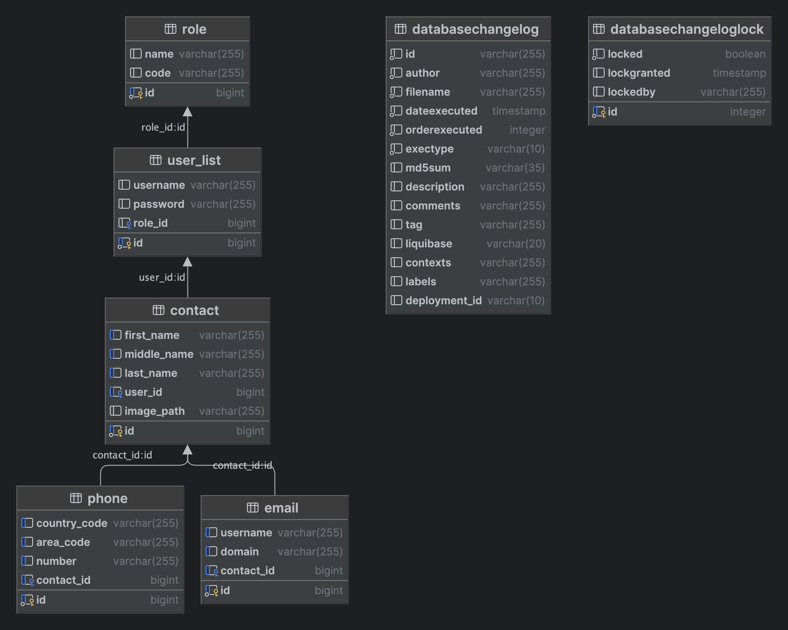

# Phone contacts application

## Description
This is a simple phone contacts application that allows you to add, edit, delete and search for contacts.

When you first start the application, the database is created and filled with roles, so you can immediately register a new user.
Don't forget to set the application.validation properties in the application.yaml file.

Please don't delete any of the docker files. compose.yml file is used with spring-boot-docker-compose to start the container with the database.
docker-compose.yml file is used to start the container with the application and the database.

## Features
- Add contact
- Edit contact
- Delete contact
- View contact
- View all contacts

## Technologies
- Java 17
- Spring Boot 3.1.1
- Spring Data JPA
- Spring Web
- Spring Security
- JWT
- MapStruct
- Hibernate
- PostgreSQL
- Liquibase
- Maven
- Lombok
- Swagger
- Docker
- Docker Compose
- JUnit 5
- Mockito



HTTP POST request to register a new user:
```
POST http://localhost:8080/register
Body
{
    “login”: “xxx”,
    “password”: “yyy”
}
```

HTTP POST authentication request:
```
POST http://localhost:8080/auth
Body
{
    “login”: “xxx”,
    “password”: “yyy”
}
```

HTTP POST request to add a new contact:
```
POST http://localhost:8080/contacts
Headers
Authorization: Bearer <token>
Body
{   
    “name”: “xxx”,
    “emails”: [“xxx@xxx.com”, “yyy@yyy.com”],
    “phones”: [“+380939333333”,”“+380939333334”, “+380939333335”]
}
```

HTTP DELETE request to delete a contact:
```
DELETE http://localhost:8080/contacts
Headers
Authorization: Bearer <token>
Body
{   
    “name”: “xxx”,
}
```

HTTP PUT request to edit a contact:
```
PUT http://localhost:8080/contacts
Headers
Authorization: Bearer <token>
Body
{   
    “name”: “xxxx”,
    “emails”: [“xxxx@xxxx.com”, “yyyy@yyyy.com”],
    “phones”: [“+380939333331”,”“+380939333332”, “+380939333333”]
}
```

HTTP GET request to view all contacts:
```
GET http://localhost:8080/contacts
Headers
Authorization: Bearer <token>
```

HTTP GET request to view a contact:
```
GET http://localhost:8080/contacts/{id}
Headers
Authorization: Bearer <token>
```